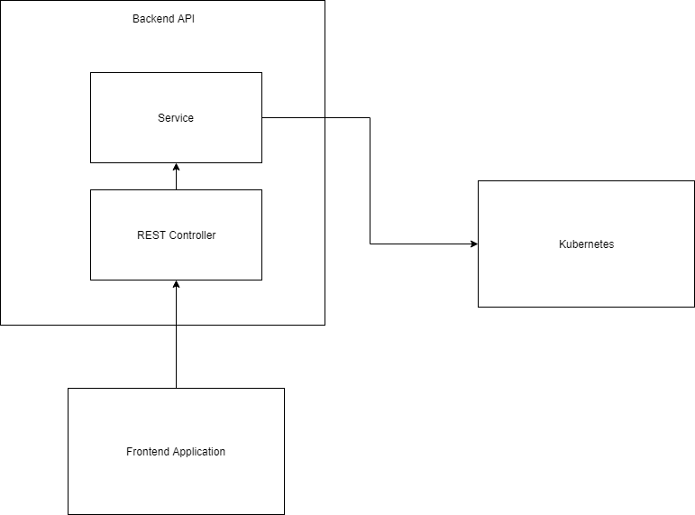

Kubernetes Orchestrator Project
---
This project aims to create/list Kubernetes Deployments

Structure
---
This project has 2 sub-projects: 
- **frontend** - Angular 7 web application to easily call backend API
- **backend** - Spring Boot based REST API, JWT authentication, this communicates with Kubernetes Cluster

Running
---
Please check `README.MD` files in both of the folders to be able to run both applications and use them

Quick Design Schema
---
